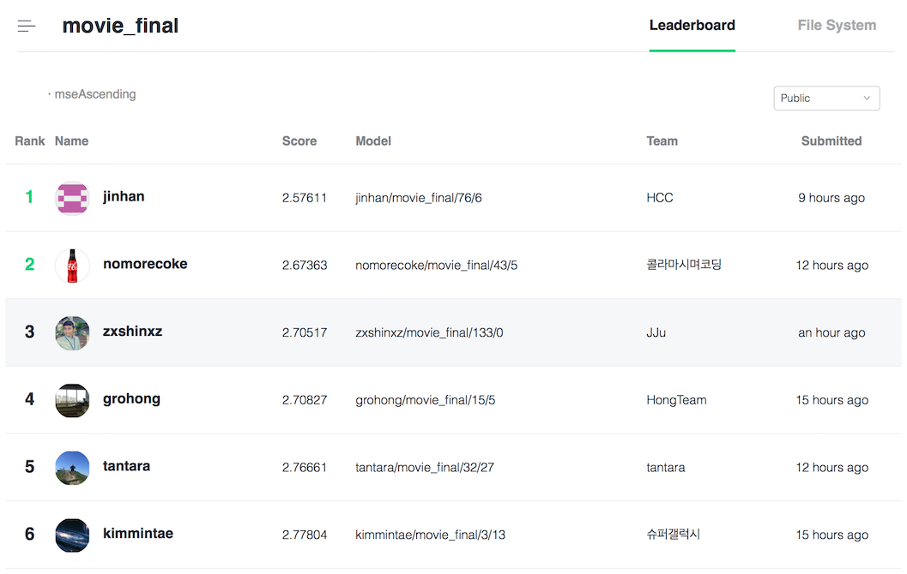

# NAVER AI Hackathon 2018 - Movie review prediction

## Authors
* [Jinhan Choi](https://github.com/jinhan)
* [Seonghyeon Kim](https://github.com/rosinality)

## Leaderboard
My team placed first place in the movie review prediction (MSE: 2.57611).

## Architecture
* Syllable embedding
* 2-layer bi-directional LSTM
* Variational dropout, Weight dropout
* Self-attention

## Regularizations
* Learning rate decay
* output clamping
* dropout: weight, variational
* data flip
* weight moving average

## Hyperparameters
|  Name | Value |
| - | - |
| Learning rate | 1e-3 |
| number of character | 4500 |
| number of embedding | 256 |
| number of hidden | 256 |
| dropout rate | 0.2 |
| gradient clip | True |
